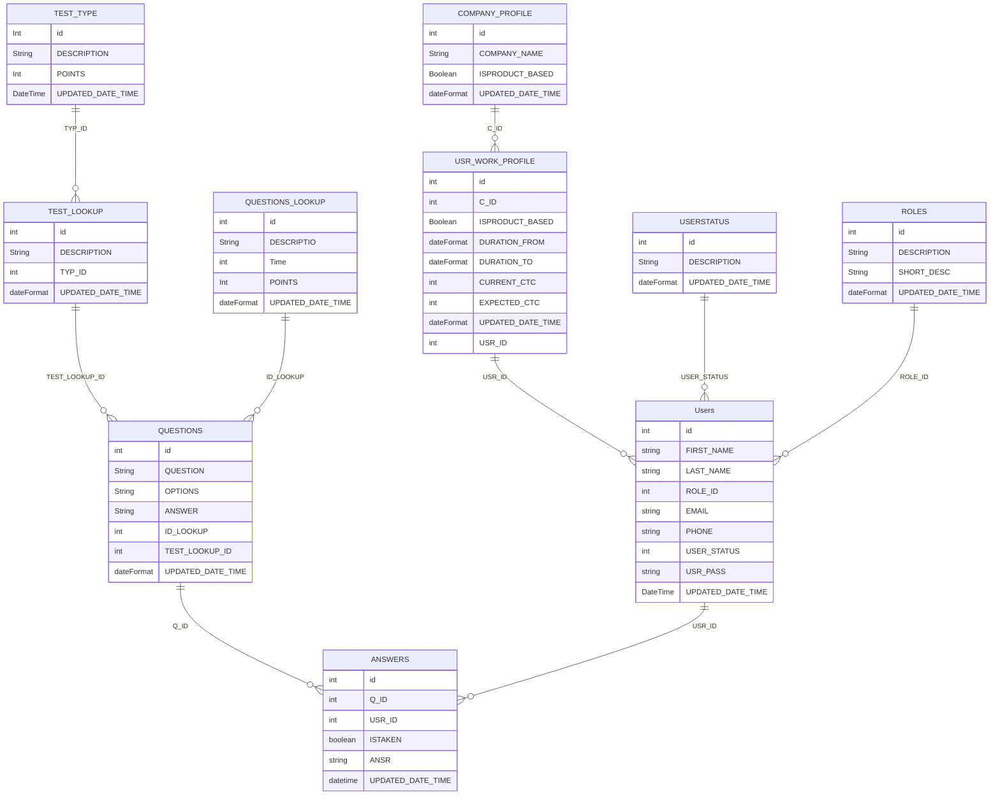
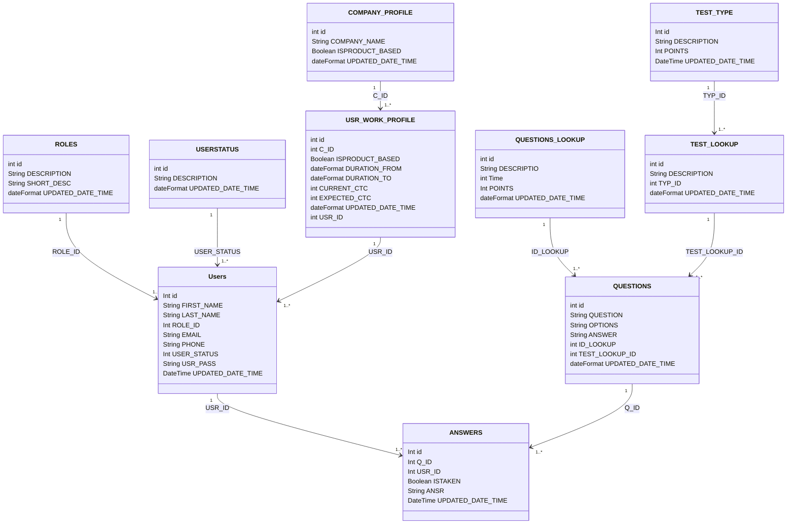

## Project Title: Automated System for Interview Candidate Assessment and Salary Determination

### Introduction:
The traditional method of interviewing candidates and determining their salary through face-to-face interviews has several drawbacks. It is time-consuming, prone to bias, and lacks objective data analysis. An automated system for candidate assessment and salary determination can help eliminate these problems.

### Project Goals:
The goal of this project is to develop an automated system that can assess candidates' skills and qualifications and determine their salary based on objective data analysis. This system will provide a fair and unbiased evaluation of candidates and their skills, enabling organizations to make informed decisions on hiring and compensation.

### Drawbacks of Traditional Face-to-Face Interview Process in Salary Determination:
The traditional face-to-face interview process has several drawbacks when it comes to determining a candidate's salary. Some of these drawbacks are:

### Subjectivity: 
The interviewers' biases can affect the candidate's evaluation and salary determination.

### Time-consuming: 
Conducting face-to-face interviews for every candidate is a time-consuming process.

### Lack of data: 
The evaluation is subjective, and there is no objective data to support the decision.

### Inconsistency: 
The evaluation criteria may not be consistent across different interviewers.

### Advantages of the Automated System over Competitors:
The automated system has several advantages over its competitors, some of which are:

Objective data analysis: 
The system uses data to evaluate the candidate's skills and qualifications, eliminating subjectivity.

### Time-saving: 
The system can evaluate candidates quickly, reducing the time required for the evaluation process.

### Consistency: 
The system uses consistent evaluation criteria, ensuring that all candidates are evaluated fairly.

### Elimination of Bias: 
The system's objective evaluation eliminates any biases that may exist in the face-to-face interview process.

### Accurate Salary Determination: 
The system uses objective data analysis to determine a candidate's salary, ensuring that it is fair and consistent with industry standards.

## Application Overview
We will be using JAVA for the API part, PostgreSQL for the data base and UI will be in latest Angular framework (Tailwind[^1] CSS as CSS framework). also here are some references that i will be using to build this application and the techniques that will be involved in developing this application.
1. Spring Cloud Gateway[^2].
2. Microservices with Spring Boot[^3].
3. Kafka (in possible areas)[^3].
4. UI Angular[^4]

This application will be having only one end point based on spring colud gateway. and we will be having a multiple microservices based on the need. also the will have multiple apps for each users. here is the highlevel overview of the application that will make you understand under the hood.

API endpoint.
1. Users/Roles
2. Questions
3. Answers
4. Company Profile[^5]
5. Canditate Profile.
6. Report

UI/APP
1. Home/Welcome App.
2. Admin App.
3. Internal user App.
4. Canditate Home App.
5. Reports App.

## Application Flow

### Task Lists
- [x] Creating Git Report and adding README.
- [ ] Linking [Flow Diagram](https://www.mermaidchart.com/). [^6]
     - [ ] Creating the `System Design`.
          - [ ] overview of the system
          - [ ] control flow overview
               - [ ] App System Design
                    - [ ] Home
                    - [x] Admin
                    - [ ] Internal User 
                    - [ ] Canditate User
                    - [ ] Report App
          
- [ ] Get the pre-requsits done
     - [ ] Install PostgreSQL in the local machine and configure the DB.
     - [ ] Create the necessary tables.
     - [ ] Create the necessary View.
     - [ ] load the tables with sample data.
     - [ ] implement logging ability in the database.

### Sample system flow (Admin app)

### SQL Table Diagram

### Class Diagram

## REFERENCS
1. [MARKDOWN SYNTAX](https://enterprise.github.com/downloads/en/markdown-cheatsheet.pdf)
2. [Grammar index](https://github.com/github/linguist/blob/master/vendor/README.md)
3. [Flow diagram fonts](https://fontawesome.com/v4/icons/)
4. for Writing mathematical expressions will be using [mathjax](https://www.mathjax.org/)
5. Automate CI/CD workflows with GitHub Actions[^7].

you will see more and more changes in this application in comming months or may be years. i will be updating this application with the latest and greatest API and UI techenology available[^note]

[^1]: Primary CSS Library is [Tamilwind](https://tailwindcss.com/).
[^2]: Spring Cloud Gateway: Resilience, Security, and Observability w/ [Thomas Vitale](https://www.youtube.com/watch?v=UXcCHX_ymag).
[^3]: If possible i will be using the Build Event-driven [Microservices with Spring Boot & Kafka](https://www.youtube.com/watch?v=HYBtWRPikgo);
[^4]: I highely relay on this course by [codewithmosh](https://codewithmosh.com/p/angular-master-class).
[^5]: This might change or will be implemented in some other end point if it makes sense.
[^6]: I am using [mermaidchart](https://www.mermaidchart.com/) to represent all the flow diagrams in this project. also there is a 
[USAGE LINK](https://mermaid.live/edit#pako:eNplj70KwzAMhF9FaM5SShevLXTKlDWLiEXitraCIxNCyLvXzQ-0VJO573Qnz9iIZTT4kBQDT3WAPOr0xVBOMEp8utCCpZ0M3KiTAHcBlRVvOkBJTwZlMnAxUPIhZ2PqByUXBwPnb3Lb9g2cPmoBV9K_jk78d5KVMRxZPy2V0xXuFVig5-jJ2fyz-WOqUTvOWWjy01I-G-uwZB8llWoKDRqNiQtMvSXlm6M2kt_E5Q2_KVsO) that shows how to use code this and use it in [github](https://docs.github.com/en/get-started/writing-on-github/working-with-advanced-formatting/creating-diagrams). also will take a look at the https://kroki.io/
[^7]: I have got the reference video regarding [GitHub Actions](https://www.youtube.com/watch?v=qy_HaIaNbkE)
[^note]:
     I am not sure how this application will end up and as far i am available for developement and growing myself up in the industry i will be working on thie project.
